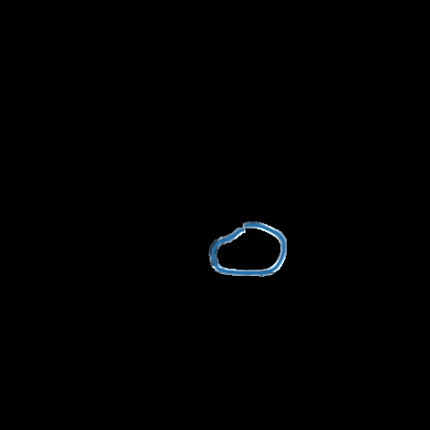

# Task 1

This task involves processing an image to extract a blue circle using OpenCV.

## Script Explanation

`task1.py` script performs the following steps:
- Reads an image from the `Task1` directory.
- Converts the image from BGR to HSV color space.
- Defines an HSV range for the blue color.
- Creates a mask to isolate the blue regions.
- Optionally dilates the mask to enhance it.
- Applies the mask to extract the blue circle.
- Saves the result as `Extracted.jpg`.
- Displays the original and the extracted images.

## Images

Original Image:

Extracted Blue Circle:

---
